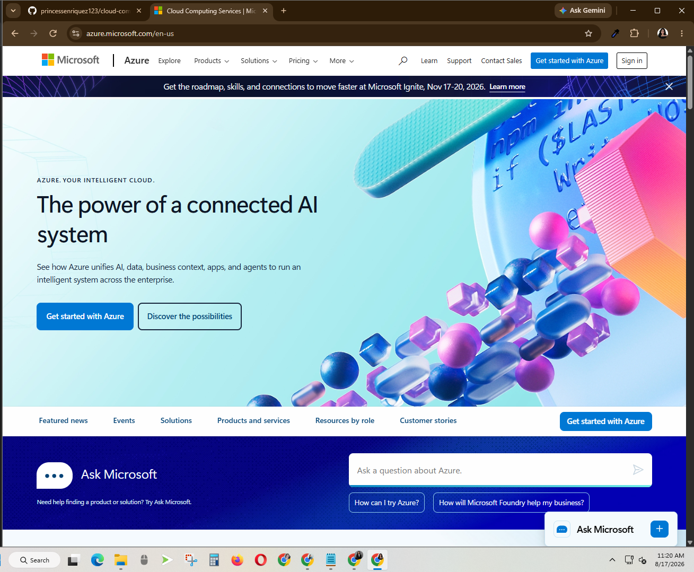

# Microsoft Azure Research

## Brief Overview
Microsoft Azure is a cloud computing platform developed by Microsoft. It provides services for computing, storage, networking, databases, security, artificial intelligence, and application development. Azure is commonly used by businesses that already use Microsoft technologies.

## Global Infrastructure
Microsoft Azure operates cloud regions around the world. Many Azure regions also provide Availability Zones, which are separate groups of data centers designed to improve reliability and availability.

## Cloud Management Console
The Azure Portal is a web-based interface used to create, manage, and monitor Azure resources. Users can manage virtual machines, databases, storage, networks, and other cloud services through the portal.

## Four Core Services
1. **Azure Virtual Machines** – Provides virtual computers for running Windows or Linux applications.
2. **Azure Blob Storage** – Provides cloud object storage for files and large amounts of unstructured data.
3. **Azure Virtual Network** – Provides private networking for Azure resources.
4. **Microsoft Entra ID** – Provides identity and access management for users and cloud resources.

## Three Advantages
1. Azure integrates well with Microsoft products and services.
2. It provides strong support for hybrid cloud environments.
3. It offers a wide range of enterprise cloud services.

## Typical Enterprise Use Cases
Azure is commonly used for Windows Server migration, cloud application hosting, data storage, databases, hybrid cloud environments, identity management, backup, and disaster recovery.

## Screenshot

