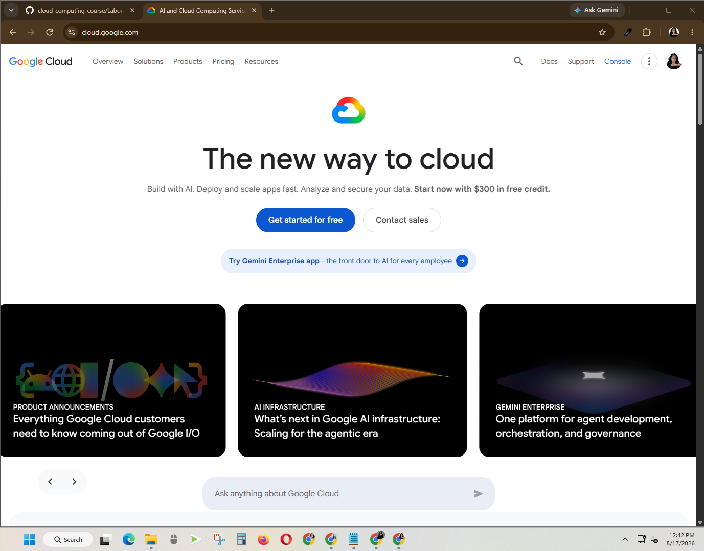

# Google Cloud Platform (GCP) Research

## Brief Overview
Google Cloud Platform (GCP) is a cloud computing platform developed by Google. It provides services for computing, storage, networking, databases, artificial intelligence, machine learning, and application development. It is commonly used for cloud-native applications, data analytics, and AI workloads.

## Global Infrastructure
Google Cloud operates a global infrastructure made up of regions and zones located around the world. It currently has 43 regions and 130 zones. These locations help organizations improve application performance, availability, and reliability.

## Cloud Management Console
The Google Cloud Console is a web-based interface used to create, manage, and monitor Google Cloud projects and resources. Users can manage virtual machines, storage, databases, networking, and other cloud services through the console.

## Four Core Services
1. **Compute Engine** – Provides virtual machines that run on Google infrastructure.
2. **Cloud Storage** – Provides object storage for files, backups, and application data.
3. **Virtual Private Cloud (VPC)** – Provides networking for Google Cloud resources.
4. **Identity and Access Management (IAM)** – Controls user access and permissions to cloud resources.

## Three Advantages
1. Google Cloud has strong artificial intelligence and machine learning services.
2. It provides strong support for Kubernetes and containerized applications.
3. It has a large global network that supports scalable applications.

## Typical Enterprise Use Cases
Google Cloud can be used for artificial intelligence, machine learning, data analytics, web application hosting, cloud storage, Kubernetes deployments, databases, and high-performance computing.

## Screenshot

